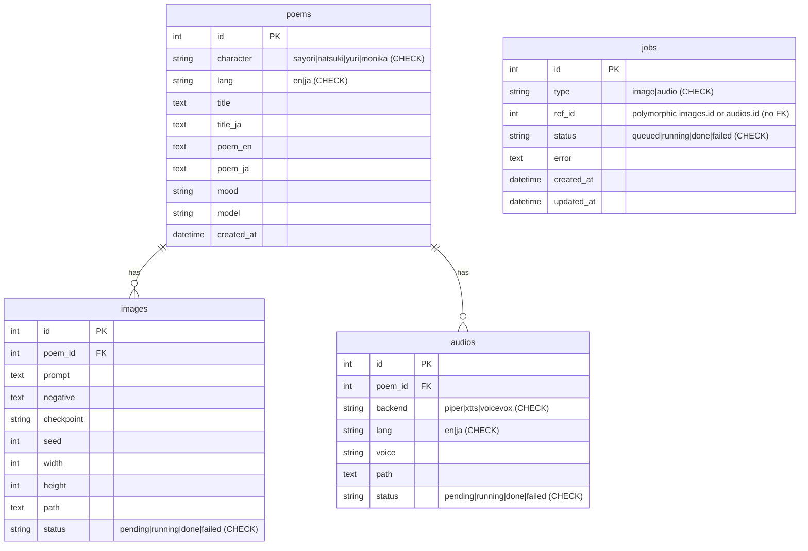
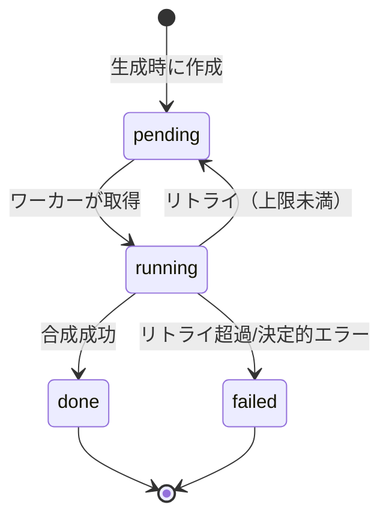

# ARCHITECTURE — DDLC Poetry Generator

## コンテナ構成

| service | 役割 | GPU | 言語/技術 |
|---|---|---|---|
| `frontend` | UI（詩・画像・音声の表示/再生） | – | Next.js + TS + Tailwind |
| `api` | オーケストレーション、Claude 呼び出し、ジョブ投入 | – | FastAPI (Python) |
| `db` | 生成物メタデータ | – | PostgreSQL |
| `redis` | ジョブキュー / ブローカー | – | Redis |
| `comfyui` | Stable Diffusion 実行（HTTP API） | ✅ 占有 | ComfyUI |
| `worker-gpu` | 画像ジョブ消費 → ComfyUI 呼び出し → 保存 | – | Python（自前の Redis list キュー） |
| `worker-tts` | 音声ジョブ消費 → Piper(CPU)/XTTS(GPU) → 保存 | △ 任意 | Python（自前の Redis list キュー） |

> 画像生成の重い処理は `comfyui` に集約し、GPU の占有点を1つにする。`worker-gpu` は
> ComfyUI の API を叩くだけなので GPU を直接持たない。XTTS を使う場合のみ `worker-tts`
> に GPU を割り当て、画像生成とは逐次化して 6GB に収める。

## GPU / VRAM 設計（GTX 1060 6GB）

- 既定: **ComfyUI(SD1.5, 512px) のみ GPU 常駐**（normalvram で ~3–4GB）。
  読み上げは **Piper(CPU)** → VRAM 競合なし。
- XTTS を有効化する場合: SD と XTTS を同時常駐させず、ジョブ単位で逐次実行
  （`TTS_BACKEND=xtts` 時はキューの並行度を制御）。
- compose の GPU 割当（抜粋）:
  ```yaml
  deploy:
    resources:
      reservations:
        devices:
          - driver: nvidia
            count: 1
            capabilities: [gpu]
  ```
  ホスト側に nvidia-container-toolkit が必要。

## 処理フロー

```
[frontend] POST /api/generate (character, theme)
     │
[api] ── Claude 1コール ──▶ {poem_en, poem_ja, image_prompt, image_negative, voice_hints}
     │  └─ poems を DB 保存、詩を即レスポンス
     │  └─ image ジョブ / audio ジョブを redis に投入
     │
[worker-gpu] image ジョブ ─▶ ComfyUI(SD) ─▶ /data に画像保存 ─▶ images 更新
[worker-tts] audio ジョブ ─▶ Piper/XTTS   ─▶ /data に音声保存 ─▶ audios 更新
     │
[frontend] GET /api/poems/{id} を約2秒間隔でポーリングして進捗確認し、絵・声が揃い次第表示
```

## ストレージ

- 生成画像・音声は名前付きボリューム `/data`（`DATA_DIR`）に保存。
- メタデータ（パス・seed・状態）は PostgreSQL。
- リポジトリには重み・生成物を含めない。

## ネットワーク / ポート

- `frontend` :3000（公開）
- `api` :8000（frontend からアクセス、必要に応じて公開）
- `comfyui` :8188 / `db` :5432 / `redis` :6379 は内部ネットワークのみ

## データモデル

生成物のメタデータは PostgreSQL に保持する（画像/音声の実ファイルは `/data` ボリューム）。



- 列の許容値は DB レベルの CHECK 制約で強制する（#123）。`jobs` は `(type, ref_id)` で
  images/audios を**多態参照**するため native FK は張らず、削除は `repository.delete_poem`
  が `(type, ref_id)` で明示的に行う（#124）。キュー走査用に `(type, status)` 複合 index を持つ。

## 状態遷移（アセット / ジョブ）

`POST /api/generate` は詩を即時に永続化し、選択されたアセットを `pending`、対応するジョブを
`queued` で作成する。ワーカーが取得して DONE/FAILED まで進める。



（`jobs.status` は queued/running/done/failed。asset の `pending` が job の `queued` に対応する。）

## 信頼性 / 運用

ジョブキューは **at-least-once** 配送で、途中でクラッシュしてもジョブを落とさない設計（#58, #126）:

- **予約 (reserve)**: `BLMOVE` で id をキュー → 処理中リスト（processing list）へアトミックに
  移動し、処理完了で `LREM`（ack）する。
- **reaper**: 起動時と定期メンテで、処理中リストに残った（＝前のワーカーが途中で落ちた）id を
  キューへ戻す。
- **reconciler**: 起動時に「DB は queued/running なのに Redis から消えた」孤児ジョブを再投入。
  さらに定期メンテでも **QUEUED 限定**で再投入し、「commit 後に enqueue 失敗」等をワーカー
  再起動を待たずに自己修復する（#126）。処理中（RUNNING）のジョブは対象外なので二重処理しない。
- **リトライ / デッドレター**: 失敗ジョブは `JOB_MAX_RETRIES` まで再投入し、超過で `failed` に
  して可視化する（Redis の retry カウンタは TTL 付き）。
- **冪等性**: ワーカーは処理前に `job.status == done` を確認し、再処理をスキップする。

その他の運用機構:

- **ヘルスチェック**: `GET /health` は DB + Redis 到達を確認し、不達なら 503（#127）。api は
  Dockerfile の `HEALTHCHECK`、frontend は compose、ワーカーは消費ループが更新する heartbeat
  ファイルの鮮度で死活を判定する。
- **生成の同時実行上限**: 同期 Claude 呼び出しが threadpool を枯渇させないよう
  `GENERATE_MAX_CONCURRENCY` で上限化し、超過は即 503（#59）。
- **レート制限**: `RATE_LIMIT_PER_MIN` で `POST /api/generate` を IP 毎に制限（#20, #57）。
- **外部呼び出し**: Claude / ComfyUI はタイムアウト＋指数バックオフでリトライ。
- **可観測性**: 各リクエスト/ジョブに相関 ID（`X-Request-ID`）を付与し、`LOG_FORMAT=json` で
  構造化ログに切替可能。`SENTRY_DSN` 設定時のみ Sentry を有効化する（#128）。
- **ネットワーク分離 / 認証**: `edge`（frontend + api）と `internal`（db/redis/comfyui/worker）を
  分離し、侵害された frontend が backend に直接到達できないようにする。認証（`API_AUTH_TOKEN`）と
  CORS の設計は README「認証（API_AUTH_TOKEN）とブラウザ UI」節を参照。
